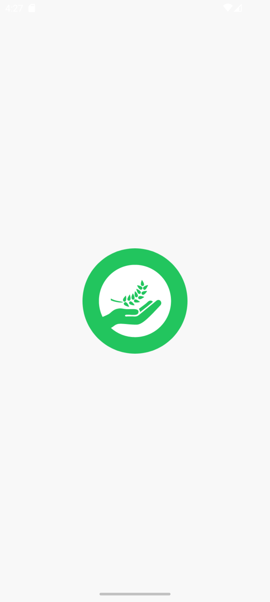
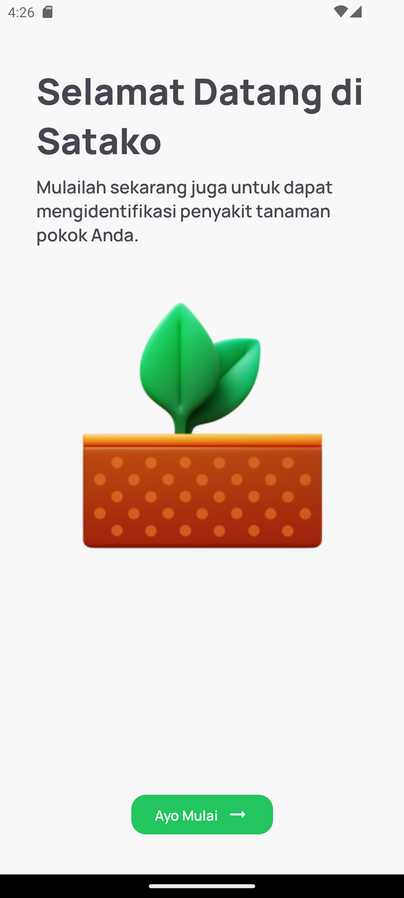
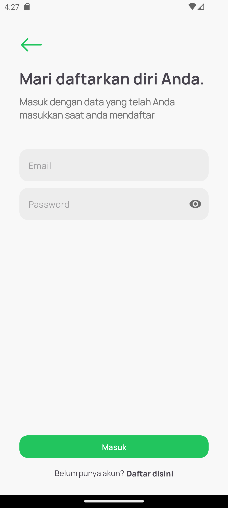
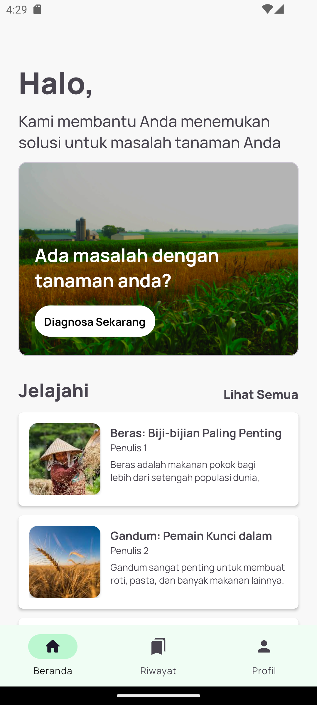
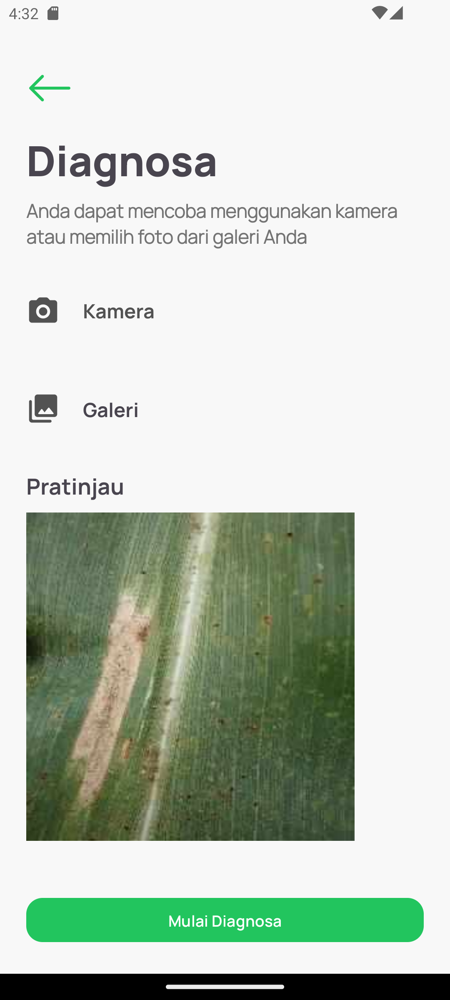
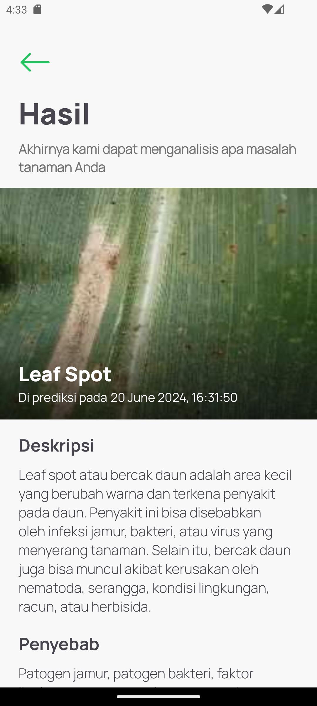

<!--  -->

# **SATAKO : Sayangi Tanaman Pokok** 

#### Get started to be able identify your staple plant disease.

This repository is the Capstone Project in [Bangkit Academy](https://grow.google/intl/id_id/bangkit/) 2024 Batch 1. This application is purpose to help users get information about diseases in plants, especially food crops 

## Our Team
| Name                            | Bangkit-ID    | Path               |
| -------------                   | ------------- | -------------      |
| Dimas Naufaldy Ardian           | M011D4KY1591  | Machine Learning   |
| Salma Zhahira                   | M011D4KX2205  | Machine Learning   |
| Panji Nugraha Adhi              | M009D4KY2726  | Machine Learning   |
| Devi Mikhael Empi               | C009D4KY0561  | Cloud Computing    |
| Fitriya Nur Saidah              | C200D4KX1090  | Cloud Computing    |
| Fathan Maulana Rifqi Hartono    | A129D4KY3914  | Mobile Development |
| Ruben Alexander                 | A009D4KY4462  | Mobile Development |

# Installation the App

## Getting started
- Prerequisites
  - Android Version: 7.0 (Nougat) or higher
  - Internet connection

- Installation
  - Download the APK
  - Install the APK

## Usage
### How to diagnose the disease
  - Open App
  - On the login screen, enter your email and password.
  - If you do not have an account, tap on __Daftar Disini__ and follow the prompts to register.
  - Once you have entered your credentials, tap __Masuk__
  - After logging in, click __Diagnosa Sekarang__
  - The app may prompt you to provide images for a more accurate diagnosis. You can choose to either:
    - Pick from __Camera__: Use your device’s camera to take a new photo.
        - Tap on "Camera."
        - Capture the image.
        - Crop the photo if it meets the requirements.
    - Pick from __Gallery__: Select an existing photo from your device’s gallery.
        - Tap on "Gallery."
        - Browse through your photos and select the appropriate image
        - Crop the photo if it meets the requirements. 
  - Click __Mulai Diagnosa__
  - If the analysis is successful, you will be taken to a result page.

### How to see the predict history
  - Open App
  - If you are not __logged in__, you will see the login screen:
    - Enter your email and password. 
    - If you do not have an account, tap on "Daftar Disini" and follow the prompts to register. 
    - Once you have entered your credentials, tap "Masuk"
  - If you are already __logged in__, you will be taken directly to the main screen of the app.
  - Click __History__ on Bottom Navigation.
  - That'll be show the history what you've predicted before.

## Setup
Clone the repository on your machine. Open the project on your Android Studio and run it.

## About
- Predict diseases in the images you upload.
- Cropping the image.
- Predict History
- Clean and Simple Material UI
- Light Mode and Dark Mode 🌗
- Clear Cache
## 📸 Screenshots
||||
|:----------------------------------------:|:-----------------------------------------:|:-----------------------------------------: |
|  |  |  |
|  |  |  |

## Built With 🛠
- [Kotlin](https://kotlinlang.org/) - First class and official programming language for Android development.
- [Coroutines](https://kotlinlang.org/docs/reference/coroutines-overview.html) - A coroutine is a concurrency design pattern that you can use on Android to simplify code that executes asynchronously.
- [LiveData](https://developer.android.com/topic/libraries/architecture/livedata) -  oOservable data holder class.
- [Android Architecture Components](https://developer.android.com/topic/libraries/architecture) - Collection of libraries that help you design robust, testable, and maintainable apps.
    - [ViewModel](https://developer.android.com/topic/libraries/architecture/viewmodel) - Stores UI-related data that isn't destroyed on UI changes.
    - [ViewBinding](https://developer.android.com/topic/libraries/view-binding) - Generates a binding class for each XML layout file present in that module and allows you to more easily write code that interacts with views.
    - [Data Store](https://developer.android.com/topic/libraries/architecture/datastore) - Data storage solution that allows you to store key-value pairs or typed objects with protocol buffers.
- [Dependency Injection](https://developer.android.com/training/dependency-injection) - A technique widely used in programming and well suited to Android development.
- [Retrofit](https://square.github.io/retrofit/) - A type-safe HTTP client for Android and Java.
- [GSON](https://github.com/google/gson) - A modern JSON library for Kotlin and Java.
- [GSON Converter](https://github.com/square/retrofit/tree/master/retrofit-converters/gson) - A Converter which uses GSON for serialization to and from JSON.
- [Material Components for Android](https://github.com/material-components/material-components-android) - Modular and customizable Material Design UI components for Android.
- [Splash API Android](https://developer.android.com/develop/ui/views/launch/splash-screen) - The elements of the splash screen are defined by XML resource files in the Android manifest file. 
- [uCrop](https://github.com/Yalantis/uCrop) - Provide an ultimate and flexible image cropping experience.
- [CameraX](https://developer.android.com/jetpack/androidx/releases/camera) - An addition to Jetpack that makes it easier to add camera capabilities to your app.

## Contact
Visit:
- [fathanmaulgit's](https://github.com/fathanmaul)
- [rubenalexanderrr git's](https://github.com/rubenalexanderrr)
